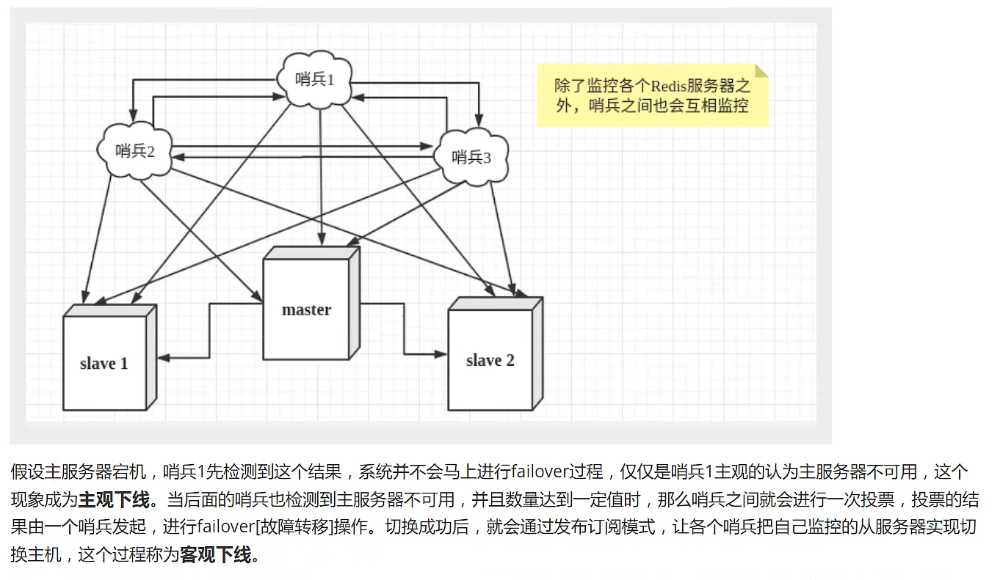

如本文章又不懂地方可以查询以下博客

```url
https://blog.csdn.net/fl8545/article/details/109383010?ops_request_misc=%257B%2522request%255Fid%2522%253A%2522165016301916780261969409%2522%252C%2522scm%2522%253A%252220140713.130102334.pc%255Fall.%2522%257D&request_id=165016301916780261969409&biz_id=0&utm_medium=distribute.pc_search_result.none-task-blog-2~all~first_rank_ecpm_v1~rank_v31_ecpm-2-109383010.142^v9^pc_search_result_cache,157^v4^control&utm_term=%E7%8B%82%E7%A5%9E%E8%AF%B4redis%E7%AC%94%E8%AE%B0&spm=1018.2226.3001.4187
```

# Redis入门

## 概述

> Redis是什么

Redis ( `Re`mote `Di`ctionary `S`erver)，即远程字典服务!

> Redis能干嘛

1、内存存储、持久化，内存中是断电即失、所以说持久化很重要( rdb、aof )
2、效率高，可以用于高速缓存
3、发布订阅系统
4、地图信息分析
5、计时器、计数器（浏览量!)
6、…....

> 特性

1、多样的数据类型
2、持久化
3、集群
4、事务
5、......

## Window安装

1、下载得到安装包：https://github.com/dmajkic/redis/releases

2、解压后


3、点击redis-server.exe运行

> 闪退参考：https://blog.csdn.net/Ordinary_Boy__/article/details/104892554


4、使用redis客服端(redis-cli)来连接redis


## LInux安装

1、下载安装包：http://redis.cn/

2、上传到linux，并解压


3、进入解压后的文件，可以看到我们redis的配置文件


4、基本的环境安装

```bash
yum install gcc-c++

make

make install
```


5、redis默认安装路径`/usr/local/bin`


6、将redis配置文件。复制到我们当前目录下


7、redis默认不是后台启动的，修改配置文件!


8、启动redis服务


9、使用redis-cli进行连接测试！


10、查看redis进程是否开


11、如何关闭redis服务

shutdown


再次查看进程


## 测试性能

redis-benchmark 是一个压力测试工具!

官方自带的一个新能测试工具！


测试：

```bash
#测试：100个并发连接100000请求
redis-benchmark -h localhost -p 6379 -c 100 -n 100000
```


如何查看这些分析：


## 基础的知识

redis默认有16个数据库，默认使用的是第0个数据库


可以使用select切换数据库

```bash
localhost:6379> select 3#切换数据库
OK
localhost:6379[3]> dbsize#查看当前数据库大小
(integer) 0
localhost:6379[3]> set name mxp
OK
localhost:6379[3]> dbsize
(integer) 1
127.0.0.1:6379[3]> flushdb#清空当前数据库
OK
127.0.0.1:6379[3]> keys *
(empty list or set)
```

> Redis 是单线程的

明白Redis是很快的，官方表示，Redis是基于内存操作，CPU不是Redis性能瓶颈，Redis的瓶颈是根据机器的内存和网络带宽，既然可以使用单线程来实现，所以就用单线程了!

Redis是C语言写的，官方提供的数据为100000+的QPS，完全不比同样是使用key-vale的Memecache差!

**Redis 为什么单线程还这么快？**

1、误区1︰高性能的服务器一定是多线程的?

2、误区2∶多线程（CPU上下文会切换!)一定比单线程效率高!

先去CPU>内存>硬盘的速度要有所了解!
核心: redis是将所有的数据全部放在内存中的，所以说使用单线程去操作效率就是最高的，多线程（ CPU上下文会切换︰耗时的操作!! ! )，对于内存系统来说，如果没有上下文切换效率就是最高的！

# 五大数据类型

> 官方文档

Redis 是一个开源（BSD许可）的，内存中的数据结构存储系统，它可以用作`数据库`、`缓存`和`消息中间件`。 它支持多种类型的数据结构，如 [字符串（strings）](http://redis.cn/topics/data-types-intro.html#strings)， [散列（hashes）](http://redis.cn/topics/data-types-intro.html#hashes)， [列表（lists）](http://redis.cn/topics/data-types-intro.html#lists)， [集合（sets）](http://redis.cn/topics/data-types-intro.html#sets)， [有序集合（sorted sets）](http://redis.cn/topics/data-types-intro.html#sorted-sets) 与范围查询， [bitmaps](http://redis.cn/topics/data-types-intro.html#bitmaps)， [hyperloglogs](http://redis.cn/topics/data-types-intro.html#hyperloglogs) 和 [地理空间（geospatial）](http://redis.cn/commands/geoadd.html) 索引半径查询。 Redis 内置了 [复制（replication）](http://redis.cn/topics/replication.html)，[LUA脚本（Lua scripting）](http://redis.cn/commands/eval.html)， [LRU驱动事件（LRU eviction）](http://redis.cn/topics/lru-cache.html)，[事务（transactions）](http://redis.cn/topics/transactions.html) 和不同级别的 [磁盘持久化（persistence）](http://redis.cn/topics/persistence.html)， 并通过 [Redis哨兵（Sentinel）](http://redis.cn/topics/sentinel.html)和自动 [分区（Cluster）](http://redis.cn/topics/cluster-tutorial.html)提供高可用性（high availability）。

## Redis-key

```bash
127.0.0.1:6379> keys *
1) "sex"
2) "name"
127.0.0.1:6379> exists name #查看当前key是否存在
(integer) 1
127.0.0.1:6379> move name 1	#移动一个key到另一个数据库
(integer) 1
127.0.0.1:6379> keys *
1) "sex" 
127.0.0.1:6379> expire sex 10 #设置key的过期时间，单位是秒
(integer) 1
127.0.0.1:6379> ttl sex	#查看当前key的剩余时间
(integer) 7
127.0.0.1:6379> ttl sex
(integer) 5
127.0.0.1:6379> ttl sex
(integer) 0
127.0.0.1:6379> 
127.0.0.1:6379> ttl sex
(integer) -2
127.0.0.1:6379> set name mxp
OK
127.0.0.1:6379> type name#查看当前key的类型
string
```

## String

```bash
127.0.0.1:6379> keys *
1) "name"
127.0.0.1:6379> append age 1#如果没有当前的key就添加一个
(integer) 1
127.0.0.1:6379> keys *
1) "age"
2) "name"
127.0.0.1:6379> append age 2#为当前的key追加一个
(integer) 2
127.0.0.1:6379> get age
"12"
127.0.0.1:6379> del name#删除当前的key
(integer) 1
127.0.0.1:6379> keys *
1) "age"
========================================================
127.0.0.1:6379> get age
"0"
127.0.0.1:6379> incr age  #自增一
(integer) 1
127.0.0.1:6379> get age   
"1"
127.0.0.1:6379> decr age  #自减一
(integer) 0
127.0.0.1:6379> incrby age 10#设置步长，指定增量
(integer) 10
127.0.0.1:6379> decrby age 2#减多少
(integer) 8
127.0.0.1:6379> get age
"8"
================================================================
# 字符串范围 range
127.0.0.1:6379> set key1 "hello,mxp" 
OK
127.0.0.1:6379> get key1
"hello,mxp"
127.0.0.1:6379> getrange key1 0 3  # 截取字符串 前四个
"hell"
127.0.0.1:6379> getrange key1 0 -1	# 相当于get key1
"hello,mxp"
127.0.0.1:6379> 

# 替换！
127.0.0.1:6379> set key2 abcde
OK
127.0.0.1:6379> get key2
"abcde"
127.0.0.1:6379> setrange key2 0 xxx #替换指定位置开始的字符串!
(integer) 5
127.0.0.1:6379> get key2
"xxxde"
================================================================
# setex(set with expire) 	# 设置过期时间 
# setnx(set if not exist) 	# 不存在，在设置 （在分布式锁中会常常使用!）

127.0.0.1:6379> setex key3 50 "hello" # 设置50秒过期
OK
127.0.0.1:6379> ttl key3
(integer) 41
127.0.0.1:6379> get key3
"hello"
127.0.0.1:6379> setnx mykey "redis"
(integer) 1
127.0.0.1:6379> keys *
1) "mykey"
2) "key3"
3) "key2"
4) "key1"
127.0.0.1:6379> setnx mykey "mongodb" # 以存在mykey这个键不能再创建了，创建失败！
(integer) 0
127.0.0.1:6379> get mykey
"redis"
================================================================
mset
mget

127.0.0.1:6379> mset k1 v1 k2 v2 k3 v3  #同时设置多个值
OK
127.0.0.1:6379> keys *
1) "k2"
2) "k3"
3) "k1"
127.0.0.1:6379> mget k1 k2 k3  #同时获取多个值
1) "v1"
2) "v2"
3) "v3"
127.0.0.1:6379> msetnx k1 v1 k4 v4  #msetnx是一个原子性的操作，要么一起成功，要么一起失败!
(integer) 0
127.0.0.1:6379> 

#对象
set user:1 {name:zhangsan ,age:3} #设置一个user:1(键) 对象值为json字符来保存一个对象!

#	这里的key是一个巧妙的设计   user:{id}: {filed} ，如此设计在Redis中是完全OK了!

127.0.0.1:6379> mset user:1:name zhangsan user:1:age 2
OK
127.0.0.1:6379> mget user:1:name user:1:age
1) "zhangsan"
2) "2"

================================================================
getset# 先get再set

127.0.0.1:6379> getset db redis
(nil)
127.0.0.1:6379> get db
"redis"
127.0.0.1:6379> getset db mongodb
"redis"
127.0.0.1:6379> get db
"mongodb"


```

## List

基本数据类型，列表
在redis里面、我们可以把list玩成，栈、队列、阻塞队列！
所有list命令都是用l开头的

```bash
##########################################################################
lpush #向左边插入
rpush #向右边插入

127.0.0.1:6379> lpush list one #将一个值或者多个值，插入到列表头部（左）
(integer) 1
127.0.0.1:6379> lpush list two 
(integer) 2
127.0.0.1:6379> lpush list three
(integer) 3
127.0.0.1:6379> lrange list 0 -1 # 获取list中的所有值
1) "three"
2) "two"
3) "one"
127.0.0.1:6379> lrange list 0 1 # 获取list中某个区间的值
1) "three"
2) "two"
############################################################################
rpop
lpop

127.0.0.1:6379> lrange list 0 -1
1) "three"
2) "two"
3) "one"
127.0.0.1:6379> lpop list #移除最左边的一个元素
"three"
127.0.0.1:6379> rpop list #移除最右边的一个元素
"one"
127.0.0.1:6379> lrange list 0 -1  
1) "two"

############################################################################
lindex #通过下标获取元素

127.0.0.1:6379> lrange list 0 -1
1) "two"
2) "3,4,5,6"
3) "7"
127.0.0.1:6379> lindex list 0
"two"
127.0.0.1:6379> lindex list 2
"7"
############################################################################
llen  #获取当前list的长度

127.0.0.1:6379> lpush list one
(integer) 1
127.0.0.1:6379> lpush list tow
(integer) 2
127.0.0.1:6379> lpush list three
(integer) 3
127.0.0.1:6379> llen list
(integer) 3
############################################################################
lrem #移除指定的值

127.0.0.1:6379> lrange list 0 -1
1) "three"
2) "three"
3) "tow"
4) "one"
127.0.0.1:6379> lrem list 1 one # 移除一个one
(integer) 1
127.0.0.1:6379> lrange list 0 -1
1) "three"
2) "three"
3) "tow"
127.0.0.1:6379> lrem list 2 three # 移除二个three
(integer) 2
127.0.0.1:6379> lrange list 0 -1
1) "tow"
############################################################################
ltrim #通过下标截取元素，会改变原list

127.0.0.1:6379> lrange mylist 0 -1
1) "hello"
2) "hello1"
3) "hello2"
4) "hello3"
127.0.0.1:6379> ltrim mylist 1 2
OK
127.0.0.1:6379> lrange mylist 0 -1
1) "hello1"
2) "hello2"
############################################################################
rpoplpush # 移除列表右边第一个元素添加到另外一个列表的左边的第一个元素

127.0.0.1:6379> lrange mylist 0 -1
1) "hello1"
2) "hello2"
3) "hello3"
127.0.0.1:6379> rpoplpush mylist myotherlist
"hello3"
127.0.0.1:6379> lrange mylist 0 -1
1) "hello1"
2) "hello2"
127.0.0.1:6379> lrange myotherlist 0 -1
1) "hello3"
############################################################################
lset #将列表中指定下标的值替换为另外的值

127.0.0.1:6379> exists list
(integer) 0
127.0.0.1:6379> lset list 0 item #不存在就会报错
(error) ERR no such key
127.0.0.1:6379> lpush list value1
(integer) 1
127.0.0.1:6379> lrange list 0 0
1) "value1"
127.0.0.1:6379> lset list 0 item
OK
127.0.0.1:6379> lrange list 0 0 
1) "item"
127.0.0.1:6379> lset list 1 value2 #存在这个list但是list里面不存在下标为1的元素，也会报错
(error) ERR index out of range
############################################################################
linsert #向list中指定的位置插值

127.0.0.1:6379> lrange mylist 0 -1
1) "world"
2) "hello"
127.0.0.1:6379> linsert mylist before hello other
(integer) 3
127.0.0.1:6379> lrange mylist 0 -1
1) "world"
2) "other"
3) "hello"

```

> 小结

- 它实际上是一个列表
- 如果移除了列表中所有的值，空列表，那这个列表也是不存在的
- 消息队列( Lpush Rpop ) ，栈( Lpush Lpop )

## Set

`set不能重复`

```bash
127.0.0.1:6379> sadd myset hello  		#存储一个值hello
(integer) 1
127.0.0.1:6379> sadd myset hello1		
(integer) 1
127.0.0.1:6379> sadd myset hello2
(integer) 1
127.0.0.1:6379> smembers myset			#获取set集合中所有的值
1) "hello1"
2) "hello"
3) "hello2" 
127.0.0.1:6379> sismember myset hello   #判断当前的值是否存在，这个set集合中
(integer) 1
127.0.0.1:6379> sismember myset hello00000
(integer) 0
############################################################################
127.0.0.1:6379> scard myset #查看当前set值的个数
(integer) 3
############################################################################
rem

127.0.0.1:6379> smembers myset
1) "hello1"
2) "hello"
3) "hello2"
127.0.0.1:6379> srem myset hello1  #删除指定元素
(integer) 1
127.0.0.1:6379> scard myset
(integer) 2
############################################################################
srandmember myset  #随机选出一个元素

127.0.0.1:6379> smembers myset
1) "hello"
2) "hello2"
127.0.0.1:6379> srandmember myset
"hello"
127.0.0.1:6379> srandmember myset
"hello"
127.0.0.1:6379> srandmember myset
"hello2"
127.0.0.1:6379> srandmember myset
"hello2"
127.0.0.1:6379> srandmember myset 2  #随机选出指定个数个元素
1) "hello"
2) "hello2"
############################################################################
#随机删除

127.0.0.1:6379> smembers myset
1) "hello4"
2) "hello"
3) "hello2"
4) "hello3"
127.0.0.1:6379> spop myset 1 #随机删除指定个数
1) "hello3"
127.0.0.1:6379> spop myset 2
1) "hello2"
2) "hello4"
127.0.0.1:6379> smembers myset
1) "hello"
############################################################################
#将一个set里面的元素移动到另外一个set中

127.0.0.1:6379> sadd myset1 hello1
(integer) 1
127.0.0.1:6379> sadd myset2 hello2
(integer) 1
127.0.0.1:6379> smove myset1 myset2 hello1
(integer) 1
127.0.0.1:6379> smembers myset1
(empty list or set)
127.0.0.1:6379> smembers myset2
1) "hello1"
2) "hello2"
############################################################################
数学中的集合：
- 差集  diss
- 交集  inter
- 并集  union

127.0.0.1:6379> sadd key1 a
(integer) 1
127.0.0.1:6379> sadd key1 b
(integer) 1
127.0.0.1:6379> sadd key1 c
(integer) 1
127.0.0.1:6379> sadd key2 a
(integer) 1
127.0.0.1:6379> sadd key2 e
(integer) 1
127.0.0.1:6379> sadd key2 f
(integer) 1
127.0.0.1:6379> sdiff key1 key2 #差集,key1有key2没有的，有哪些
1) "b"
2) "c"
127.0.0.1:6379> SINTER key1 key2 #交集
1) "a"
127.0.0.1:6379> SUNION key1 key2 #并集
1) "f"
2) "c"
3) "a"
4) "b"
5) "e"
```

应用场景：
微博、b站 共同关注（并集）

- `sdiff set1 set2` 差集
- `sinter set1 set2`交集 共同关注就可以这么实现
- `sunion set1 set2`并集

## Hash

set myhash(键) （field maxiaopeng）(值)：相当于 HashMap<String,HashMap<String,Strings>> 感觉有点像

```bash
127.0.0.1:6379> hset myhash field1 maxiaopeng #设置一个key-value
(integer) 1
127.0.0.1:6379> hget myhash field1 #获取一个值
"maxiaopeng"
127.0.0.1:6379> hmset myhash field1  hello field2 world #设置多个key-value
OK
127.0.0.1:6379> hmget myhash field1 field2 #获取多个值
1) "hello"
2) "world"
127.0.0.1:6379> hgetall myhash #查看全部值
1) "field1"k
2) "hello"v
3) "field2"key
4) "world"value
127.0.0.1:6379> hdel myhash field1 #删除指定的值
(integer) 1
127.0.0.1:6379> hgetall myhash
1) "field2"
2) "world"
127.0.0.1:6379> hlen myhash #获取长度
(integer) 1
############################################################################
判断hash中指定字段是否存在

127.0.0.1:6379> hgetall myhash
1) "field2"
2) "world"
127.0.0.1:6379> HEXISTS myhash field2
(integer) 1
127.0.0.1:6379> HEXISTS myhash mxp
(integer) 0

############################################################################
#只获取所有的field
#只获取所有的value
127.0.0.1:6379> hkeys myhash
1) "field2"
127.0.0.1:6379> hgetall myhash
1) "field2"
2) "world"
127.0.0.1:6379> hkeys myhash
1) "field2"
127.0.0.1:6379> hvals myhash
1) "world"
############################################################################
incr hsetnx

127.0.0.1:6379> hset myhash field3 4
(integer) 1
127.0.0.1:6379> HINCRBY myhsah field3 2 #自增2
(integer) 2
127.0.0.1:6379> HINCRBY myhsah field3 -1 
(integer) 1
127.0.0.1:6379> hsetnx myhsah firld3 99 #不存在firld3 设置成功
(integer) 1
127.0.0.1:6379> hsetnx myhsah field3 99 #存在field3 设置失败
(integer) 0
127.0.0.1:6379> hsetnx myhsah field4 99 #不存在firld4 设置成功
(integer) 1
127.0.0.1:6379> hgetall myhsah
1) "field3"
2) "1"
3) "firld3"
4) "99"
5) "field4"
6) "99"
```

保存变更的数据，可以将一个用户变形为has`hset hash user:id:name zhangsan`，因此hash更适合存储对象，而string比较适合存储字符串

## Zset(有序集合)

`有序不重复集合`

在set的基础上增加了一个值，set k1 v1    zset k1 score1 v1

```bash
127.0.0.1:6379> zadd myzset 1 one   
(integer) 1
127.0.0.1:6379> zadd myzset 2 two 3 three  #添加多个值
(integer) 2
127.0.0.1:6379> zrange myzset 0 -1 #查看zset的所有值
1) "one"
2) "two"
3) "three"

############################################################################
#zrangebyscore 排序

127.0.0.1:6379> zadd salary 10000 lisi
(integer) 1
127.0.0.1:6379> zadd salary 2000 zhangsan
(integer) 1
127.0.0.1:6379> zadd salary 5000 maxiaopeng
(integer) 1
127.0.0.1:6379> zrangebyscore salary -inf +inf #对zset进行从小到大排序，显示值
1) "zhangsan"
2) "maxiaopeng"
3) "lisi"

127.0.0.1:6379> zrangebyscore salary -inf +inf withscores # 从小到大排序，显示值和score
1) "zhangsan"
2) "2000"
3) "maxiaopeng"
4) "5000"
5) "lisi"
6) "10000"
127.0.0.1:6379> zrangebyscore salary -inf 5000 withscores #查询score -inf 到 5000的数据
1) "zhangsan"
2) "2000"
3) "maxiaopeng"
4) "5000"

127.0.0.1:6379> zrevrange salary 0 -1 withscores #从大到小
1) "maxiaopeng"
2) "5000"
3) "zhangsan"
4) "2000"
############################################################################
# rem 	删除指定元素
# card	获取集合总的个数

127.0.0.1:6379> zrange salary 0 -1
1) "zhangsan"
2) "maxiaopeng"
3) "lisi"
127.0.0.1:6379> zrem salary lisi 
(integer) 1
127.0.0.1:6379> zrange salary 0 -1
1) "zhangsan"
2) "maxiaopeng"
127.0.0.1:6379> zcard salary
(integer) 2
############################################################################
#count 获取指定区间的成员数量
127.0.0.1:6379> zrevrange salary 0 -1 withscores
1) "maxiaopeng"
2) "5000"
3) "zhangsan"
4) "2000"
127.0.0.1:6379> zcount salary 0 3000 #获取0-3000的个数
(integer) 1
127.0.0.1:6379> 
```

# 三种特殊数据类型

## [地理空间（geospatial）](http://redis.cn/commands/geoadd.html)

geo 				spatial   空间的  斯杯秀

官方文档：https://www.redis.net.cn/order/3685.html

获取城市经纬度：http://www.jsons.cn/lngcode/

> geoadd

```bash
# geoadd key value(纬度、经度、名称)  添加一个地理空间

# 127.0.0.1:6379> geoadd china:city 39.90 116.41 beijing
# (error) ERR value is not a valid float

有效的经度从-180度到180度。
有效的纬度从-85.05112878度到85.05112878度。
当坐标位置超出上述指定范围时，该命令将会返回一个错误。

127.0.0.1:6379> geoadd china:city 116.41 39.90 beijing
(integer) 1
127.0.0.1:6379> geoadd china:city 106.50 29.53 chongqing
(integer) 1
127.0.0.1:6379> geoadd china:city 113.66 34.75 henan
(integer) 1
```

> getpos

```bash
127.0.0.1:6379> geopos china:city beijing
1) 1) "116.40999823808670044"
   2) "39.90000009167092543"
127.0.0.1:6379> geopos china:city henan
1) 1) "113.65999907255172729"
   2) "34.74999926510690784"
127.0.0.1:6379> geopos china:city chongqing
1) 1) "106.49999767541885376"
   2) "29.52999957900659211"
127.0.0.1:6379> 
```

> Redis GEODIST 命令 - 返回两个给定位置之间的距离

二人直接的距离

单位：

- **m** 表示单位为米。
- **km** 表示单位为千米。
- **mi** 表示单位为英里。
- **ft** 表示单位为英尺。

如果用户没有显式地指定单位参数， 那么 `GEODIST` 默认使用米作为单位。

```bash
127.0.0.1:6379> geodist china:city henan chongqing #查看河南到重庆的直线距离单位：m
"889365.7366"
127.0.0.1:6379> geodist china:city henan chongqing km
"889.3657"
```

> Redis GEORADIUS 命令 - 以给定的经纬度为中心， 找出某一半径内的元素

```bash
127.0.0.1:6379> georadius china:city 110 35 3000 km
1) "chongqing"
2) "henan"
3) "beijing"
127.0.0.1:6379> georadius china:city 110 35 1000 km
1) "chongqing"
2) "henan"
3) "beijing"
127.0.0.1:6379> georadius china:city 110 35 500 km
1) "henan"
127.0.0.1:6379> georadius china:city 110 35 5000 km count 2 #只要这个半径范围内的2个数据
1) "henan"
2) "chongqing"
127.0.0.1:6379> georadius china:city 110 35 5000 km count 3
1) "henan"
2) "chongqing"
3) "beijing"
```

> Redis GEORADIUSBYMEMBER 命令 - 找出位于指定范围内的元素，中心点是由给定的位置元素决定

```bash
127.0.0.1:6379> GEORADIUSBYMEMBER china:city chongqing 1000 km
1) "chongqing"
2) "henan"
127.0.0.1:6379> GEORADIUSBYMEMBER china:city chongqing 500 km
1) "chongqing"
```

> Redis GEOHASH 命令 - 返回一个或多个位置元素的 Geohash 字符串表示

```bash
# 将二维的经纬度转换为一维的字符串，如果两个字符串越接近，那么则距离越近!
127.0.0.1:6379> GEOHASH china:city chongqing
1) "wm5xzrybty0"
127.0.0.1:6379> GEOHASH china:city henan
1) "ww0vdqh9mv0"
```

> GEO底层的实现原理其实就是Zset !我们可以使用Zset命令来操作geo !

```bash
# 发现geo中没有删除命令，可以用zset来做

127.0.0.1:6379> zrange china:city 0 -1 #查看地图中全部元素
1) "chongqing"
2) "henan"
3) "beijing"
127.0.0.1:6379> zrem china:city beijing 
(integer) 1
127.0.0.1:6379> zrange china:city 0 -1
1) "chongqing"
2) "henan"
```

## Redis HyperLogLog

 HyperLogLog  海配loglog   以pf开头的命令

> 什么是基数？

A{1,3,5,7,8,7}
B{1,3,5,7,8}

基数（不重复的元素) = 5，可以接受误差!  这里AB都是5

> 简介

Redis 2.8.9版本就更新了Hyperloglog数据结构!

Redis Hyperloglog基数统计的算法!

优点∶占用的内存是固定，保存2^64，只需要废12KB内存!如果要从内存角度来比较的话Hyperloglog首选!

**网页的浏览量 (一个人访问一个网站多次，但是还是算作一个人! )**

传统的方式，set 保存用户的id，然后就可以统计set 中的元素数量作为标准判断!

这个方式如果保存大量的用户id，就会比较麻烦!我们的目的是为了计数，而不是保存用户id ;

官方说会有0.81%错误率!统计UV任务，可以忽略不计的!

```bash
127.0.0.1:6379> pfadd mykey1 a b c d e f j #创建一组元素
(integer) 1
127.0.0.1:6379> pfadd mykey2 x y z a 
(integer) 1
127.0.0.1:6379> pfcount mykey1 #获取这组元素的个数
(integer) 7
127.0.0.1:6379> pfcount mykey2
(integer) 4 
127.0.0.1:6379> pfmerge mykey3 mykey1 mykey2 # 合并两组 并集
OK
127.0.0.1:6379> pfcount mykey3#查看并集的数量
(integer) 10
```

## bitmaps

> 位存储

统计用户信息，活跃，不活跃!登录、未登录!打卡，365打卡!两个状态的，都可以使用Bitmaps !

Bitmaps位图，是数据结构!都是操作二进制位来进行记录，就只有0和1两个状态!

> 测试

使用bitmap来记录周一到周日的打卡!  `1表示打卡`

```bash
127.0.0.1:6379> setbit sign 0 1 #设置一个值
(integer) 0
127.0.0.1:6379> setbit sign 1 0
(integer) 0
127.0.0.1:6379> setbit sign 2 0
(integer) 0
127.0.0.1:6379> setbit sign 3 1
(integer) 0
127.0.0.1:6379> setbit sign 4 1
(integer) 0
127.0.0.1:6379> setbit sign 5 1
(integer) 0
127.0.0.1:6379> setbit sign 6 0
(integer) 0
127.0.0.1:6379> getbit sign 0 #获取一个值
(integer) 1
127.0.0.1:6379> getbit sign 1 #获取星期一的值
(integer) 0
127.0.0.1:6379> bitcount sign #统计这周打卡的天数
(integer) 4
```

# 事务

Redis事务本质:一组命令的集合!一个事务中的所有命令都会被序列化，在事务执行过程的中，会按照顺序执行!

一次性、顺序性、排他性!执行一些列的命令!

```bash
----------- 队列 set set set 执行 ----------
```

Redis事务没有没有隔离级别的概念！

所有的命令在事务中，并没有直接被执行！只有发起执行命令的时候才会执行!

Redis单条命令式保存原子性的，但是事务不保证原子性！和`mysql`不同

redis的事务：

- 开启事务（multi）
- 命令入队 （）
- 执行事务（exec）

> 正常执行事务案例

```bash
127.0.0.1:6379> MULTI #开启事务
OK
#命令入队
127.0.0.1:6379> set key1 v1
QUEUED
127.0.0.1:6379> set key2 v2
QUEUED
127.0.0.1:6379> get key2
QUEUED
#执行事务
127.0.0.1:6379> exec
1) OK
2) OK
3) "v2"
```

> 放弃事务

```bash
127.0.0.1:6379> MULTI 
OK
127.0.0.1:6379> set key4 v4
QUEUED
127.0.0.1:6379> discard #放弃事务
OK
127.0.0.1:6379> get key4
(nil)
```

> 代码本身有问题，事务中所有命令都会失效

```bash
127.0.0.1:6379> MULTI
OK
127.0.0.1:6379> set key100 v100
QUEUED
127.0.0.1:6379> setttt key200 v200
(error) ERR unknown command `setttt`, with args beginning with: `key200`, `v200`, 
127.0.0.1:6379> exec
(error) EXECABORT Transaction discarded because of previous errors.
127.0.0.1:6379> get key 100
(error) ERR wrong number of arguments for 'get' command
```

> 像：1/0 ，就是代码本身没问题，但是逻辑不通，这种的话`其他`命令是可以正常运行的。

```bash
127.0.0.1:6379> MULTI
OK
127.0.0.1:6379> set key100 v100
QUEUED
127.0.0.1:6379> set keyStr 'zhangsan'
QUEUED
127.0.0.1:6379> incr keyStr #会执行失败
QUEUED
127.0.0.1:6379> exec
1) OK
2) OK
3) (error) ERR value is not an integer or out of range
127.0.0.1:6379> get key100
"v100"
```

# 锁

悲观锁：认为干嘛都会出现问题，必须的加锁，就好比你进厕所必须锁门，认为比有人冲进来。

乐观锁：顾名思义十分乐观，认为干嘛都不会出现问题，只是更新数据的时候会拿一个version字段去判断一下，

在次期间，是否有人以及修改过了、且修改成功后version会加一。如果version不相等的话，就会操作失败。

> redis里面有一个(watch)：  就可以实现加锁  这里指的是乐观锁

```bash
#正常执行成功

127.0.0.1:6379> set money 100
OK
127.0.0.1:6379> set out 0
OK
127.0.0.1:6379> watch money #监视money对象
OK
127.0.0.1:6379> MULTI #开启事务
OK
127.0.0.1:6379> decrby money 20
QUEUED
127.0.0.1:6379> incrby out 20
QUEUED
127.0.0.1:6379> exec #事务执行成功 watch 监控的对象失效
1) (integer) 80
2) (integer) 20
127.0.0.1:6379> get money 
"80"
127.0.0.1:6379> get out
"20"
```

```bash
# 模拟多个线程

127.0.0.1:6379> keys *
1) "out"
2) "money"
127.0.0.1:6379> watch money
OK
127.0.0.1:6379> MULTI
OK
127.0.0.1:6379> decrby money 20
QUEUED
127.0.0.1:6379> incrby out 20
QUEUED
127.0.0.1:6379> exec  #在结束事务时，下面的代码抢先执行了，所以执行失败
(nil)

# 在multi期间 对加锁的数据money 进行了修改 
127.0.0.1:6379> incrby money 1000
(integer) 1080

# 失败了，就可以先解锁
127.0.0.1:6379> unwatch # 解锁，因为事务执行失败是不会自动解锁的
OK
127.0.0.1:6379> watch money # 重新加锁，获取最新的version
OK
127.0.0.1:6379> MULTI
OK
127.0.0.1:6379> decrby money 500
QUEUED
127.0.0.1:6379> incrby out 500
QUEUED
127.0.0.1:6379> exec # 判断version值是否一样，true -- > 就执行事务里面的逻辑
1) (integer) 580
2) (integer) 520

```

# jedis

> 是java操作redis中间件的工具包

## 连接

1、导入对应依赖

```xml
 <!--导入jedis的包-->
        <!-- https://mvnrepository.com/artifact/redis.clients/jedis -->
        <dependency>
            <groupId>redis.clients</groupId>
            <artifactId>jedis</artifactId>
            <version>3.2.0</version>
        </dependency>

        <!--fastjson-->
        <dependency>
            <groupId>com.alibaba</groupId>
            <artifactId>fastjson</artifactId>
            <version>1.2.62</version>
        </dependency>
```

2、编写代码

```java
 public static void main(String[] args) {
        // 1、获取连接对象                    这里就连接本地的
        Jedis jedis = new Jedis("127.0.0.1", 6379);
        // 2、测试连接
        System.out.println(jedis.ping());

    }
```

## 事务操作

```java
package com.peng;

import com.alibaba.fastjson.JSONObject;
import redis.clients.jedis.Jedis;
import redis.clients.jedis.Transaction;

/**
 * @描述： 测试事务
 */
public class TestTX {
    public static void main(String[] args) {
        Jedis jedis = new Jedis("127.0.0.1", 6379);

        jedis.flushDB();

        JSONObject jsonObject = new JSONObject();
        jsonObject.put("hello", "world");
        jsonObject.put("name", "peng");
        String s = jsonObject.toJSONString();

        System.out.println("JOSN"+s);

        //开启事务
        Transaction multi = jedis.multi();

        try {
            multi.set("user1", s);
            multi.set("user2", s);
//            int a = 1 / 0;// 代码抛出异常
            multi.exec();//提交事务
        } catch (Exception e) {
            multi.discard(); // 放弃事务
            e.printStackTrace();
        } finally {
            System.out.println(jedis.get("user1"));
            System.out.println(jedis.get("user2"));
            jedis.close();
        }


    }
}
```

# SpringBoot整合

说明:在SpringBoot2.x之后，原来使用的jedis被替换为了lettuce？

jedis :采用的直连，多个线程操作的话，是不安全的，如果想要避免不安全的，使用jedis pool 连接池！更像 BIO

lettuce :采用netty，`实例可以再多个线程中进行共享`，不存在线程不安全的情况！可以减少线程数量 了，更像 NIO 模式

扩展：$netty是一个服务端的编程框架，简化了基于TCP和UDP的socket服务开发$

```java
public class RedisAutoConfiguration {

	@Bean
	@ConditionalOnMissingBean(name = "redisTemplate")//如果没有这个redisTemplate就生效,说明可以自定义
	public RedisTemplate<Object, Object> redisTemplate(RedisConnectionFactory redisConnectionFactory)
			throws UnknownHostException {
        //默认的 RedisTemplate 没有过多的设置，redis对象都是需要序列化!
        //而且你这里使用的是lettuce 是关于IO的肯定是需要序列化的
		RedisTemplate<Object, Object> template = new RedisTemplate<>();
		template.setConnectionFactory(redisConnectionFactory);
		return template;
	}

	@Bean
	@ConditionalOnMissingBean
	public StringRedisTemplate stringRedisTemplate(RedisConnectionFactory redisConnectionFactory)//由于string 是redis中最常使用的类型，所以说单独提出来了一个bean !
			throws UnknownHostException {
		StringRedisTemplate template = new StringRedisTemplate();
		template.setConnectionFactory(redisConnectionFactory);
		return template;
	}

}
```

> 整合测试一下

1.导入依赖

```xml
<dependency>
    <groupId>org.springframework.boot</groupId>
    <artifactId>spring-boot-starter-data-redis</artifactId>
</dependency>
```

2.配置连接

```properties
#配置redis
spring.redis.host=127.0.0.1
spring.redis.port=6379
```

3.测试

 ```java
@SpringBootTest
class Redis02SpringbootApplicationTests {

    @Autowired
    RedisTemplate redisTemplate;

    @Test
    void contextLoads() {

        //opsForValue 操作字符串的
        //opsForHash 操作Hash的
        //都是opsFor开头的

        //redisTemplate.opsForHash()

        //获取redis的连接对象
//        RedisConnection connection = redisTemplate.getConnectionFactory().getConnection();
//        connection.flushDb();
//        connection.flushAll();

        redisTemplate.opsForValue().set("key1","v1");
        System.out.println(redisTemplate.opsForValue().get("key1"));
    }

}
 ```


> 是因为RedisTemplate默认是用JdkSerializationRedisSerializer,这种序列化会转义，就成了上面的情况

RedisTemplate.java


`关于对象的保存`,对象保存必须要序列化,说明这个user必须要实现 Serializable


现在同时解决上面问题，就需要注册自己的RedisTemplate

```java
@Configuration
public class RedisConfig {

    @Bean
    public RedisTemplate<String, Object> redisTemplate2(RedisConnectionFactory redisConnectionFactory) throws UnknownHostException {
        RedisTemplate<String, Object> template = new RedisTemplate();
        template.setConnectionFactory(redisConnectionFactory);

        //使用json的方式序列化所有对象
        Jackson2JsonRedisSerializer<Object> jackson2JsonRedisSerializer = new Jackson2JsonRedisSerializer(Object.class);
        ObjectMapper objectMapper = new ObjectMapper();
        objectMapper.setVisibility(PropertyAccessor.ALL, JsonAutoDetect.Visibility.ANY);
        objectMapper.enableDefaultTyping(ObjectMapper.DefaultTyping.NON_FINAL);
        jackson2JsonRedisSerializer.setObjectMapper(objectMapper);

        //创建string的序列化器
        StringRedisSerializer stringRedisSerializer = new StringRedisSerializer();

        //设置所有的key都使用string类型的序列化器
        template.setKeySerializer(stringRedisSerializer);

        //设置所有的hash类型的key也是用string类型的序列化器
        template.setHashKeySerializer(stringRedisSerializer);

        //设置hash类型的value使用json序列化器
        template.setHashValueSerializer(jackson2JsonRedisSerializer);

        //设置所有的value都使用json序列化器
        template.setValueSerializer(jackson2JsonRedisSerializer);

        template.afterPropertiesSet();

        return template;
    }
}
```

`再去测试就成功了`

# Redis持久化

> Redis是内存数据库，如果不进行持久化，一旦服务器关机了，数据就会丢失，所以Redis提供了持久化功能

## RDB(Redis DataBase)

> 是什么

## 

RDB保存的文件就是dump.rdb
关于快照的配置都在SNAPSHOTTING 项中
当我们修改了配置文件后，需要`使用save命令就可以保存修改`


**.rdb文件触发机制**

自动触发

- 在配置文件中的save，例如60秒内修改了5个key就会触发RDB，生成一个dump.rdb文件
- 退出redis，输入命令shutdown，就会关闭redis服务，这个时候也会生成RDB文件。

手动触发

- save命令：同步，在主线程中保存快照；阻塞当前Redis服务器，直到RDB过程完成为止，对于内存比较大的实例会造成长时间阻塞，线上环境不建议使用；

- bgsave命令：异步，Redis进程执行fork操作创建子进程，RDB持久化过程由子进程负责，完成后自动结束。堵塞只发生在fork阶段，一般时间很短；BGSAVE命令是针对SAVE堵塞问题做的优化。因此Redis内部所有的设计RDB的操作都采用BGSAVE的方式，而save命令已经废弃。


**如何通过RDB文件恢复我们的数据**

- 只需要将rdb文件放在我们redis启动目录就可以，redis启动的时候会自动检查demp.rdb恢复其中的数据
- 查看rdb文件保存的位置，输入命令config get dir 如果在该目录下存在dump.rdb，就会自动恢复其中的数据

**RDB的优点：**

- 适合大规模的数据恢复

**RDB的缺点：**

- 需要一定的时间间隔进行操作，如果redis意外宕机了，最后一次修改的数据就没有了
- fork进程的时候回占用一定的内存空间

## AOF（Append Only File）

> 是什么：将我们的所有命令都记录下来，history，恢复的时候就把这个文件全部在执行一遍!


以日志的形式来记录每个写操作，将Redis执行过的所有指令记录下来(读操作不记录），只许追加文件(记录指令的文件)但不可以改写文件，redis启动之初会读取该文件重新构建数据，换言之，redis重启的话就根据日志文件的内容将写指令从前到后执行一次以完成数据的恢复工作

`aof保存的是appendonly.aof文件`如果你要查看配置文件就在APPEND ONLY MODE中


```bash
#持久化策略

# appendfsync always      #每一次都去修改
# appendfsync everysec    #每秒都去修改
# appendfsync no          #不做修改
```

默认是不开启的，我们需要手动进行配置!我们只需要将appendonly 改为yes就开启了aof !

重启，redis 就可以生效了!

如果这个aof文件有错位，这时候redis是启动不起来的话，我们需要修复这个aof文件

redis给我们提供了一个工具：redis-check-aof --fix

> 测试，修改appendonly.aof 后的效果

```bash
#写入二个值
127.0.0.1:6379> set k1 v1
OK
127.0.0.1:6379> set k2 v2
OK
```

查看appendonly.aof 文件


```bash
#可以看到跟我存的结果一样，但是会存在一定的误差
127.0.0.1:6379> keys *
1) "k2"
2) "k1"
127.0.0.1:6379> mget k1 k2
1) "v1"
2) "v2"
```

AOF优点：

- ​	每次修改都同步，文件的完成性会更好
- ​	每秒同步一次，可能会丢失最后一秒数据
- ​	从不同步，效率最高

AOF缺点：

- ​	相对于rdb，aof远大于rdb，修复速度也比rdb慢
- ​	aof运行效率也比rdb慢，因此默认rdb

# redis实现订阅发布

​	与消息中间件MQ中发布订阅一样，是一种消息通信模式，发送者pub发送消息到channel，订阅者sub从channel获取消息，redis实现的发布订阅相比MQ要简单一些，主要是几个命令。主要的应用场景例如微博微信的关注等等。redis客户端可以订阅任意数量的频道（channel）

Redis 发布订阅命令：


channel    频道;渠道;电视台;   恰楼    这里指的就是频道

> 测试

```bash
#订阅端
127.0.0.1:6379> sbuscribe mxp #订阅mxp这个频道
(error) ERR unknown command `sbuscribe`, with args beginning with: `mxp`,   
127.0.0.1:6379> subscribe mxp
Reading messages... (press Ctrl-C to quit)
1) "subscribe"
2) "mxp"
3) (integer) 1
1) "message"       #消息
2) "mxp"           #消息来自哪一个频道
3) "xvexi,redis"   #消息的具体内容

#发送端
127.0.0.1:6379> ping
PONG
127.0.0.1:6379> PUBLISH mxp "xvexi,redis" #给mxp这个频道发送信息
(integer) 1
```

> 原理

Redis是用c实现的

redis-server里其实维护了一个字典，字典的键就是一个个频道！而字典的值则是一个链表，链表中就保存了订阅者。SUBSCRIBE命令的关键，就是将客户端添加到给定频道(channel)的订阅链表中。


**使用场景**

1、实时聊天室  - --> 让channel接收到了，然后channel发送给所有人

2、订阅消息

稍微复杂的场景我们就会使用消息中间件MQ

# Redis主从复制

> 为什么需要主从复制

因为怕一台电脑如果宕机了咋办、那么用户就没办法执行一些操作了，这样时候就需要主从复制。保证用户可以拿到数据和读取数据。

> 什么是redis主从复制

就是将一台redis服务器的数据，复制到其他的redis服务器，前者称为主节点（master/leader，主节点不用配置，redis默认单机就是主节点），后者称为从节点（slave/follower）；数据的复制是单向的，只能由主节点到从节点。master以写为主，slave以读为主。主从复制，读写分离。


## 配置环境

只配置从库，不用配置主库！因为redis默认自己就是一个主库

```bash
127.0.0.1:6379> info replication  #查看当前库的信息
# Replication
role:master # 当前角色 master
connected_slaves:0 # 0个从节点
master_replid:5d0485bc15332e0bc3f6cc224ea67a0e3b35566b
master_replid2:0000000000000000000000000000000000000000
master_repl_offset:0
second_repl_offset:-1
repl_backlog_active:0
repl_backlog_size:1048576
repl_backlog_first_byte_offset:0
repl_backlog_histlen:0
```

复制3个配置文件、然后修改对应信息

1、端口

2、pid名字

3、log文件名


4、dump.rdb名字

修改完毕之后，启动我们的3个redis服务器，可以通过进程信息查看！


## 一主二从

`默认情况下，每台Redis服务器都是主节点`

我们一般情况下，只需要配置从机，就行了

认老大！一主（79）二从(80,81)

```bash
127.0.0.1:6380> SLAVEOF 127.0.0.1 6379  #找谁当自己的老大
OK
127.0.0.1:6380> info replication
# Replication
role:slave  # 当前角色变为了slave
master_host:127.0.0.1 #可以看到主机的信息
master_port:6379
master_link_status:up
master_last_io_seconds_ago:6
master_sync_in_progress:0
slave_repl_offset:14
slave_priority:100
slave_read_only:1
connected_slaves:0
master_replid:007ce28cf5cc03338f9e24fbe910ac96bdab3a7f
master_replid2:0000000000000000000000000000000000000000
master_repl_offset:14
second_repl_offset:-1
repl_backlog_active:1
repl_backlog_size:1048576
repl_backlog_first_byte_offset:1
repl_backlog_histlen:14


#在主机中查看
127.0.0.1:6379> info replication
role:master
connected_slaves:1 #从机的数量
slave0:ip=127.0.0.1,port=6380,state=online,offset=238,lag=1 #从机的信息 
master_replid:007ce28cf5cc03338f9e24fbe910ac96bdab3a7f
master_replid2:0000000000000000000000000000000000000000
master_repl_offset:238
second_repl_offset:-1
repl_backlog_active:1
repl_backlog_size:1048576
repl_backlog_first_byte_offset:1
repl_backlog_histlen:238

#把剩下的从机加入主机就行了
```

真实的从主配置应该在配置文件中配置，这样的话是永久的，我们这里使用的是命令，暂时的!


> 注意事项

1、主机可以进行读，写操作，写完后从机直接可以获取值，但是从机不能进行写操作。

2、如果是使用命令行，来配置的主从，这个时候如果重启了，就会变回主机，就获取不了主机的值了，但是只要变回从机后就可以立马从主机拿值了。

> 复制原理


> 其他主从配置模型

上面的配置模型如下


还有另一种主从配置


这时我们也可以完成主从复制

如果没有老大了，这个时候能不能选择一个老大出来呢?   可以但是是手动的！

如果主机断开了连接，我们可以使用 SLAVEOF no one让自己变成主机!其他的节点就可以手动连接到最新的这个主节点！如果这个时候老大修复了，那就重新通过SLAVEOF命令手动连接老大就行了！

> 到这里我们就会想，能不能大哥嗝屁了，能让其他人自动当老大呢，不需要自动使用slaveof 命令。

# 哨兵模式

> 哨兵模式是一种特殊的模式，首先Redis提供了哨兵的命令，哨兵是一个独立的进程，作为进程，它会独立运行。其原理是哨兵通过发送命令，等待Redis服务器响应(包括主机和从机)，从而监控运行的多个Redis实例。


> 然而一个哨兵进程对Redis服务器进行监控，可能会出现问题，为此，我们可以使用多个哨兵进行监控。各个哨兵之间还会进行监控，这样就形成了多哨兵模式。



> 配置哨兵模式

目前我们是一主二从模式

1、配置哨兵模式的配置文件 sentinel.conf

```bash
sentinel monitor myredis 127.0.0.1 6379 1 #最后这个1代表主机挂掉之后，他会投票来选取新的主机   monitor就是监测的意思   sentinel 哨兵 myredis 是现在给主节点起的名字。
```

2、启动哨兵	

```bash
[root@localhost bin]# redis-sentinel mconfig/sentinel.conf #启动哨兵的命令
19203:X 18 Apr 2022 09:24:56.455 # oO0OoO0OoO0Oo Redis is starting oO0OoO0OoO0Oo
19203:X 18 Apr 2022 09:24:56.455 # Redis version=5.0.7, bits=64, commit=00000000, modified=0, pid=19203, just started
19203:X 18 Apr 2022 09:24:56.455 # Configuration loaded
19203:X 18 Apr 2022 09:24:56.455 * Increased maximum number of open files to 10032 (it was originally set to 1024).
                _._                                                  
           _.-``__ ''-._                                             
      _.-``    `.  `_.  ''-._           Redis 5.0.7 (00000000/0) 64 bit
  .-`` .-```.  ```\/    _.,_ ''-._                                   
 (    '      ,       .-`  | `,    )     Running in sentinel mode
 |`-._`-...-` __...-.``-._|'` _.-'|     Port: 26379
 |    `-._   `._    /     _.-'    |     PID: 19203
  `-._    `-._  `-./  _.-'    _.-'                                   
 |`-._`-._    `-.__.-'    _.-'_.-'|                                  
 |    `-._`-._        _.-'_.-'    |           http://redis.io        
  `-._    `-._`-.__.-'_.-'    _.-'                                   
 |`-._`-._    `-.__.-'    _.-'_.-'|                                  
 |    `-._`-._        _.-'_.-'    |                                  
  `-._    `-._`-.__.-'_.-'    _.-'                                   
      `-._    `-.__.-'    _.-'                                       
          `-._        _.-'                                           
              `-.__.-'                                               

19203:X 18 Apr 2022 09:24:56.456 # WARNING: The TCP backlog setting of 511 cannot be enforced because /proc/sys/net/core/somaxconn is set to the lower value of 128.
19203:X 18 Apr 2022 09:24:56.457 # Sentinel ID is 45096e1a8030b01b76924b6c4b5a6c20ba58d454
19203:X 18 Apr 2022 09:24:56.457 # +monitor master myredis 127.0.0.1 6379 quorum 1
19203:X 18 Apr 2022 09:24:56.458 * +slave slave 127.0.0.1:6380 127.0.0.1 6380 @ myredis 127.0.0.1 6379
19203:X 18 Apr 2022 09:24:56.459 * +slave slave 127.0.0.1:6381 127.0.0.1 6381 @ myredis 127.0.0.1 6379
```

如果Master节点断开了，这个时候就会从从机中随机选择一个服务器!（这里面有一个投票算法!）

现在将6379这个主机关机

```bash
127.0.0.1:6379> shutdown
not connected> exit
```

redis哨兵监控的日志


如果这时主机回来了，只能变为从机了，乖乖听6381的话

优点：

1. 哨兵集群，基于主从复制模式，所有的主从配置优点，它全有
2. 主从可以切换，系统的可用性就会更好
3. 哨兵模式就是主从模式的升级，手动到自动，更加健壮!

缺点：

1. Redis不好啊在线扩容的，集群容量一旦到达上限，在线扩容就十分麻烦！
2. 哨兵模式的配置其实是很麻烦的，里面有很多选择!

# Redis缓存穿透和雪崩(面试高频，工作常用)

> 都是为了解决服务器高可用问题，怕数据库崩掉

## 缓存穿透

> 概念

缓存穿透的概念很简单，用户想要查询一个数据，发现redis内存数据库没有，也就是缓存没有命中，于是向持久层数据库查询。发现也没有，于是本次查询失败。当用户很多的时候，缓存都没有命中（秒杀!），于是都去请求了持久层数据库。这会给持久层数据库造成很大的压力，这时候就相当于出现了缓存穿透。|

> 缓存穿透的解决方案

1、布隆过滤器

布隆过滤器是一种数据结构，对所有可能查询的参数以hash形式存储，在控制层先进行校验，不符合则丢弃，从而避免了对底层存储系统的查询压力；


2、缓存空对象

当存储层不命中后，即使返回的空对象也将其缓存起来，同时会设置一个过期时间，之后再访问这个数据将会从缓存中获取，保护了后端数据源；


但是这种方法会存在两个问题︰

- 如果空值能够被缓存起来，这就意味着缓存需要更多的空间存储更多的键，因为这当中可能会有很多的空值的键。
- 即使对空值设置了过期时间，还是会存在缓存层和存储层的数据会有一段时间窗口的不一致，这对于需要保持一致性的业务会有影响。比如：这时再查user01数据库里面已经有了，但是缓存的过期时间还没有到！

## 缓存击穿

> 概述

这里需要注意和缓存击穿的区别，缓存击穿，是指一个key非常热点，在不停的扛着大并发，大并发集中对这一个点进行访问，当这个key在失效的瞬间，持续的大并发就穿破缓存，直接请求数据库，就像在一个屏障上凿开了一个洞

当某个key在过期的瞬间，有大量的请求并发访问，这类数据一般是热点数据，由于缓存过期，会同时访问数据库来查询最新数据，并且回写缓存，会导使数据库瞬间压力过大。

> 解决方案

1、设置热点数据永不过期工

不要设置过期时间，所以不会出现热点key过期后产生的问题。

2、加互斥锁

分布式锁：使用分布式锁，保证对于每个key同时只有一个线程去查询后端服务，其他线程没有获得分布式锁的权限，因此只需要等待即可。这种方式将高并发的压力转移到了分布式锁，因此对分布式锁的考验很大。

## Redis缓存雪崩

> 概念

缓存雪崩，是指在某一个时间段，缓存集中过期失效。或者Redis宕机!


> 解决方案

1、redis高可用

这个思想的含义是，既然redis有可能挂掉，那我多增设几台redis，这样一台挂掉之后其他的还可以继续工作，其实就是搭建的集群。（异地多活!)

2、限流降级

这个解决方案的思想是，在缓存失效后，通过加锁或者队列来控制读数据库写缓存的线程数量。比如对某个key只允许一个线程查询数据和写缓存，其他线程等待。

3、数据预热

数据加热的含义就是在正式部署之前，我先把可能的数据先预先访问一遍，这样部分可能大量访问的数据就会加载到缓存中。在即将发生大并发访问前手动触发加载缓存不同的key，设置不同的过期时间，让缓存失效的时同点尽量均匀。

# 单词

```bash
dbsize		---				   	  ---			 查看当前数据库大小
flush		脸红;冲(抽水马桶);		弗拉西		      flushdb清空当前数据库，flushall清空所有数据库
exists		存在;				   一个热斯次		判断当前的key存在不
move		移动;									移动一个key到另一个数据库
expire		失效，终止		     伊克斯拜儿		  expire sex 10 #设置key的过期时间，单位是秒
append		追加				   					再这个key的value后面追加，如果没有这个key就新建
strlen		串长度								    获取当前字符串的长度
range		范围									getrange key1 0 3  # 截取字符串 前四个
												  setrange key2 0 xxx #替换指定位置开始的字符串!
											
mset、mget  										 设置或获取多个值	
getset											  先获取再设置
setex(set with expire) 		# 设置过期时间 
setnx(set if not exist) 	# 不存在，在设置 （在分布式锁中会常常使用!）
incr						#自增一
decr   						#自减一
ttl 						#查看当前key的剩余时间
geo							#地理位置

member		成员;分子		  蛮ber				   #smembers获取set集合中所有的值
card		卡片			   卡的					#获取set，zset集合总的个数
multi		多种;多数		  莫提				  #开启事务 结束事务是 exec
info replication  	#查看当前库的信息		replication  复制		---
SLAVEOF 127.0.0.1 6379  #找谁到自己的老大	slave		 奴隶		斯类午
#redis持久化二种方式：RDB  AOF
sentinel	哨兵				身体low				
```

```bash
absize flushdb exists move expire append strlen range mset member scardse setex setnx   
```

